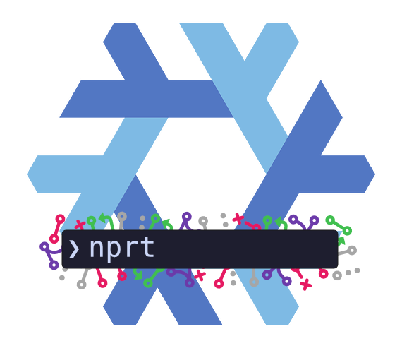

<div align="center">
    
    <br/>
    <h1>nprt</h1>
</div>

<div align="center">
  <p>
    <a href="https://github.com/thatsneat-dev/nprt/releases/latest">
      
    </a>
    <a href="https://github.com/thatsneat-dev/nprt/pulse">
      
    </a>
    <a href="https://github.com/thatsneat-dev/nprt/blob/main/LICENSE">
      
    </a>
    <a href="https://github.com/thatsneat-dev/nprt/stargazers">
      
    </a>
    <a href="https://github.com/NotAShelf/nvf/issues">
      
    </a>
    <a href="https://github.com/thatsneat-dev/nprt">
      
    </a>
  </p>
</div>

`nprt` (**N**ixpkgs **PR** **T**racker) is a CLI tool to track which
[nixpkgs](https://github.com/NixOS/nixpkgs) channels contain a given pull
request.

## Features

- Check if a PR has been merged into various nixpkgs channels
- Support for PR numbers or full GitHub URLs
- Colored terminal output with Nerd Font icons
- Clickable hyperlinks to PRs (in supported terminals)
- JSON output for scripting
- Parallel channel checking for fast results

## Installation

Requires Go 1.23 or later.

```bash
git clone https://github.com/taylrfnt/nixpkgs-pr-tracker.git
cd nixpkgs-pr-tracker
make build
```

The binary will be at `bin/nprt`.

## Usage

```bash
# Check by PR number
nprt 475593

# Check by PR URL
nprt https://github.com/NixOS/nixpkgs/pull/475593

# Check specific channels only
nprt --channels=master,nixos-unstable 475593

# JSON output for scripting
nprt --json 475593

# Force colors (useful for piping)
nprt --color=always 475593

# Verbose output for debugging
nprt --verbose 475593
```

### Example Output

```
● PR #475593 (golang: 1.23.5 -> 1.23.6)
by: someone

CHANNEL               STATUS
----------------------------
master                  ✓
staging-next            ✓
nixpkgs-unstable        ✓
nixos-unstable-small    ✓
nixos-unstable          ✗
```

The PR state icon and author line are shown for merged PRs. In terminals with
Nerd Fonts installed, state-specific icons are displayed (`\uf419` for merged,
`\uf407` for open, etc.). Set `NO_NERD_FONTS=1` to use a simple dot (●) instead.

### Options

| Option             | Description                                                 |
| ------------------ | ----------------------------------------------------------- |
| `--channels`       | Comma-separated list of channels to check                   |
| `--color`          | Color mode: `auto`, `always`, `never` (default: `auto`)     |
| `--json`           | Output results as JSON                                      |
| `--verbose`        | Show detailed progress and debug information                |
| `--version`        | Print version and exit                                      |
| `--timeline-pages` | Max pages of timeline to fetch for related PRs (default: 3) |
| `-h, --help`       | Show help message                                           |

### Environment Variables

| Variable        | Description                                                                   |
| --------------- | ----------------------------------------------------------------------------- |
| `GITHUB_TOKEN`  | GitHub personal access token for higher API rate limits                       |
| `NO_COLOR`      | Disable colors when set (respects [NO_COLOR](https://no-color.org/) standard) |
| `NO_NERD_FONTS` | Disable Nerd Font icons and use fallback dots                                 |

## Issue Handling

If you provide an issue number instead of a PR number, nprt will detect this and
display a warning with the issue details and any related pull requests found in
the issue's timeline:

```
WARNING: input is an issue, not a pull request
 Issue #12345 (Example issue title)

Related pull requests:

   #67890  Fix for issue 12345
   #67891  Another related fix
```

The related PRs are discovered via GitHub's timeline API. Use `--timeline-pages`
to control how many pages of timeline events to fetch (default: 3).

## Channels

By default, the following channels are checked:

- `master` - Main development branch
- `staging-next` - Staging integration branch
- `nixpkgs-unstable` - Unstable channel for non-NixOS users
- `nixos-unstable-small` - Fast-moving unstable channel with fewer packages
- `nixos-unstable` - Main unstable channel for NixOS

## Exit Codes

| Code | Meaning                                      |
| ---- | -------------------------------------------- |
| 0    | Success (including unmerged PRs)             |
| 1    | General error (PR not found, network issues) |
| 2    | CLI usage error (bad arguments)              |
| 3    | GitHub rate limit or auth failure            |
